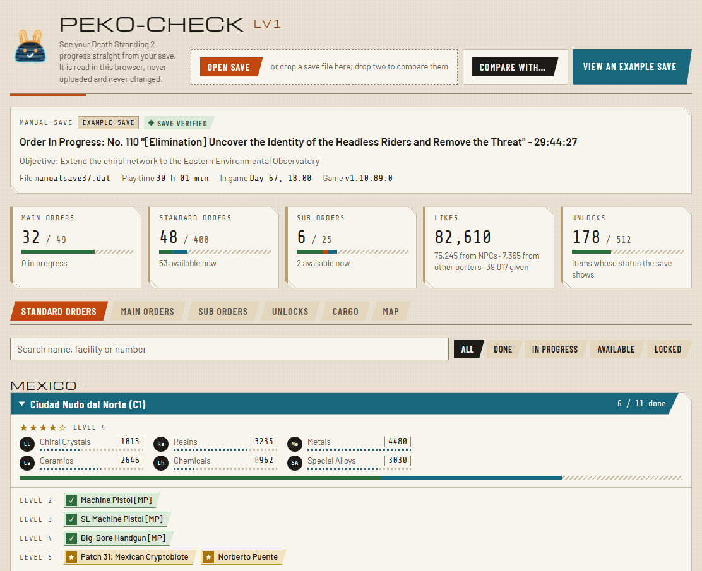
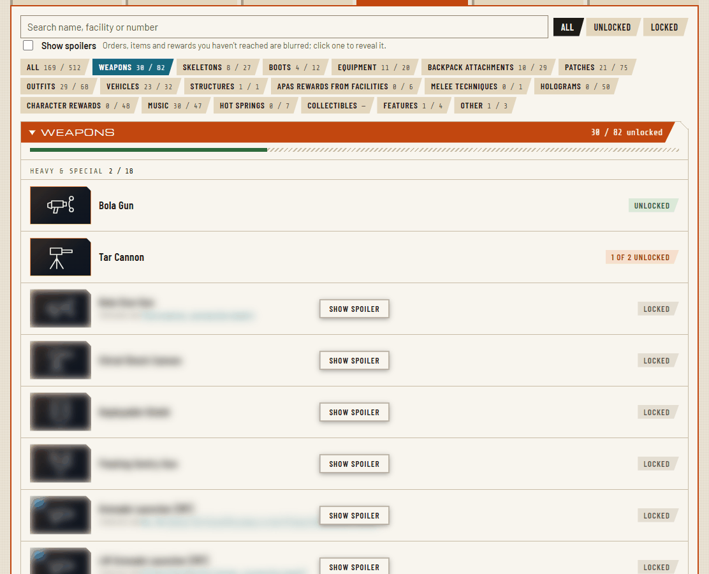
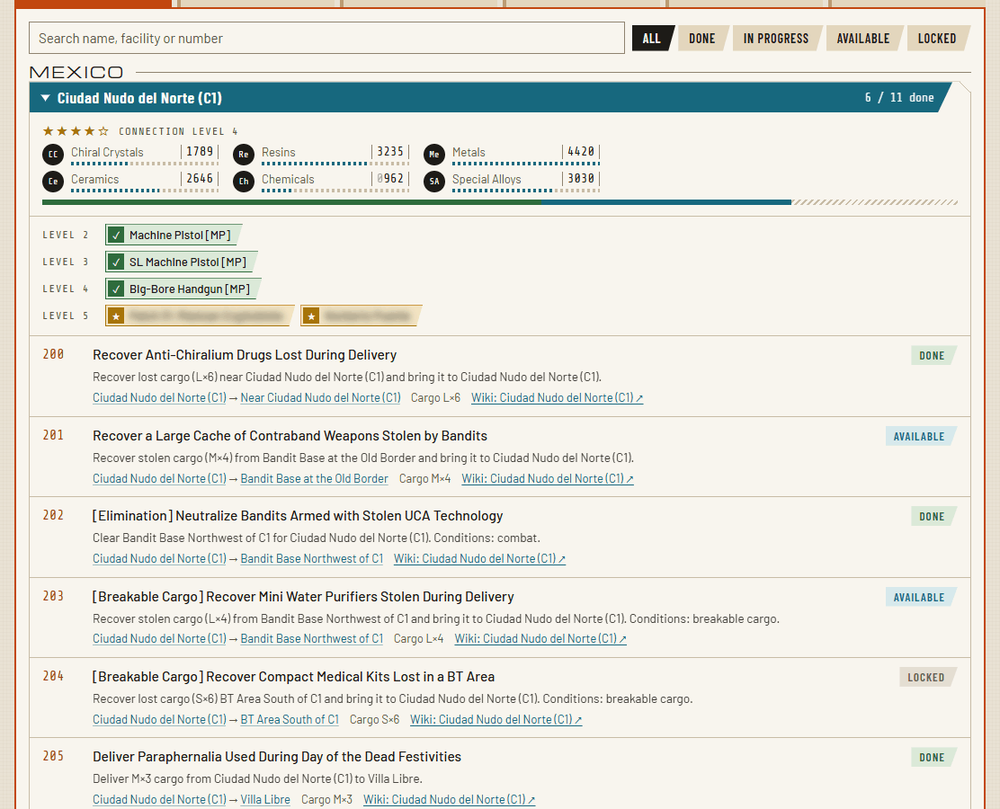
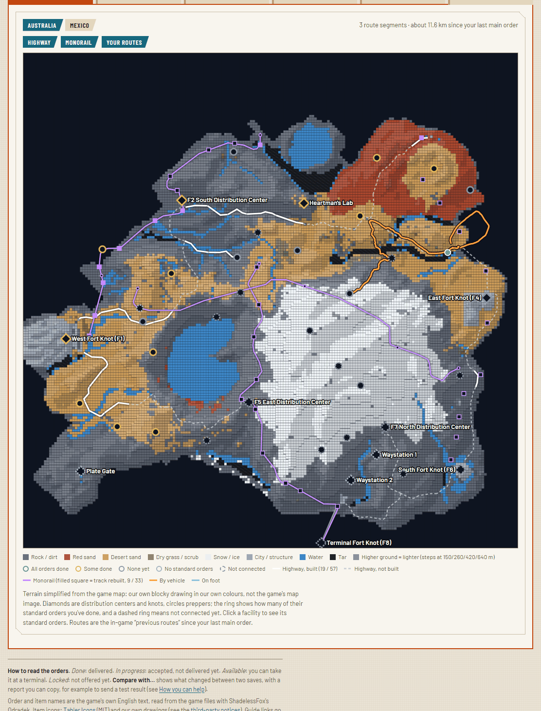

<p align="center"></p>

<h1 align="center">Peko-Check <sup>Lv1</sup></h1>

<p align="center"><b>See your Death Stranding 2 progress straight from your save: every order, every unlock, every locker.</b><br>
<i>"Commencing peko-check at once!"</i></p>

<p align="center">
  
  
  
  
  <a href="LICENSE"></a>
  
</p>

<p align="center">
  <picture>
    <source media="(prefers-color-scheme: dark)" srcset="assets/screenshots/overview-dark.png">
    
  </picture>
</p>

Open your save and Peko-Check shows which orders you've done and which are still open, how far each facility's
connection has come and what the next level gives you, which weapons and gear you have, what is in your private
locker at every facility, and where you travelled. Compare two saves to see exactly what one play session changed.

**Your save never leaves your computer.** The page reads it in your browser and uploads nothing, and it never
changes your save.

## Quick start

1. Open **[binsento-netizen.github.io/ds2-peko-check](https://binsento-netizen.github.io/ds2-peko-check/)**.
   No install needed. Want to look around first? Click **View an example save**. (You can also download this
   repository and open `viewer/index.html`; it works offline.)
2. Click **Open save** and pick a save file. They are in
   ```
   Documents\DEATH STRANDING 2 - ON THE BEACH\<a long number>\
   ```
   The long number is your Steam ID. Tip: paste `%USERPROFILE%\Documents\DEATH STRANDING 2 - ON THE BEACH` into the
   file dialog's address bar. If your Documents folder is synced to the cloud, look in that synced Documents folder
   instead. Any `manualsave…`, `autosave…` or `checkpointsave….dat` file works.
3. Browse the tabs. To see what a play session changed, open your newest save, click **Compare with…** and pick an
   older one.

Works with the PC version of Death Stranding 2. Tested with the Steam version on Windows; the Epic version and
Steam Deck are untested, so reports are welcome. Console saves are not supported.

**Spoilers:** orders you haven't reached, items you don't have yet and rewards still ahead of you are blurred. Click **Show spoiler** on one to reveal it, or tick **Show spoilers** to see everything.

## What you can see

- **Main orders as a story timeline**, episode by episode: where you are in the story, what's done and what's still
  locked, and what each order unlocks.
- **Sub orders**: the side orders, done or still open.
- **Standard orders per facility**, with the facility's connection level (stars), its material stock and what every
  level unlocks, ticked once you have it.
- **Unlocks**: weapons, gear, outfits, vehicles and more, by category. Each one links to the order or facility level
  that unlocks it. Collab items, event items and firmware updates are marked.
- **Cargo**: what Sam has equipped and in the backpack, and what is in your **private locker at each facility**,
  including how much of each material.
- **APAS** (in the Unlocks tab): every enhancement, marked developed, available to develop, or not available yet.
- **Map**: every facility with its order progress, and your routes, on our own blocky map (see [The map](#the-map)).
- **Likes** from NPCs, from other porters and given, and the **in-game day and time** of the save.
- **Save check**: each save is checked against its own built-in checksum, so a damaged file is spotted.
- **Compare two saves** (opens a **Changes** tab): which orders changed, what got unlocked and where you travelled in between, with a report
  you can copy (useful for [helping out](#how-you-can-help)).
- Order names and numbers come from the **game's own data**, so they match what you see in the game.
- Guide links for every order (Game8 or the Death Stranding Wiki; a wiki search where there's no page), and a
  **light and dark look**.

<p align="center">
  
  
</p>

### The map

The **Map** tab shows your progress on a blocky map of Australia or Mexico: every facility, ringed by how many of its
standard orders you've done, and the routes you travelled since your last main order (on foot or by vehicle). Click
a facility to jump to its orders.

<p align="center"></p>

The map and the item icons are our own drawings: the terrain is simplified from the game's map into blocks and
surface types in our own colours, and every item gets a generic icon for its kind. The game's own map image and item
pictures are copyrighted, so they aren't included.

## What it can read

| Part of the save | Status |
|---|---|
| Orders: done, in progress, available, locked | ✅ All 474 orders, with their in-game numbers |
| Unlocks: weapons, gear, outfits, vehicles and vehicle parts | ✅ Including what unlocks each one |
| Facilities: connection level, material stock | ✅ |
| Cargo: equipped, backpack, private lockers, material amounts | ✅ Which facility a locker belongs to is confirmed in game for 3 facilities so far |
| APAS enhancements | ✅ |
| Route history | ✅ |
| Likes, chiral bandwidth, in-game day and time | ✅ |
| Signs placed in the world | 🟡 Where and which type; not yet whose |
| Progress toward the next star | ❌ Not found yet |
| Music, holograms, structures and colour schemes | 🟡 Worked out from the orders and connection levels that give them where possible; not read from the save directly |
| Built structures, route planner, auto-paver progress | ❌ Not found yet |

How the file works, for the curious: [docs/FORMAT.md](docs/FORMAT.md).

## How you can help

Everything above was worked out with **save pairs**: save, do exactly one thing in the game, save again, and look
at what changed. The ❌ rows need more of those, and so far all of them came from one player's saves. You don't
need to share your save file for this.

**How to send a result**
1. Make a manual save, do the one thing from the table below and nothing else, then make another manual save.
2. Open the newer save in Peko-Check, click **Compare with…** and pick the older one.
3. In the **Changes** tab, click **Copy report**. Paste it into a [new issue](../../issues/new/choose) together with
   what you did and what the game showed (a photo of the screen helps).

The report contains no personal data. Please don't attach the save files themselves: they contain your Steam ID and
other players' names.

**Wanted**

| Test | What to do | What it solves |
|---|---|---|
| Music or hologram | Save just before and just after a reward that gives one song or hologram, with nothing else happening | Showing which songs and holograms you have |
| New structure | Save before and after reaching a connection level that unlocks a new structure | Same, for structures |
| Star progress | Note how full a facility's next star is, make one delivery there without levelling up, note it again | Showing progress toward the next star |
| Collectible | Save before and after picking up a memory chip or another collectible | Showing collectibles |
| Your own sign | Save, place one sign, save again | Telling your signs apart from other players' |
| Locker check | Compare a locker in the **Cargo** tab with the game's own locker screen at that facility | Confirming which facility each locker belongs to |
| Newer game version | Open a save from a newer patch and tell us if something looks wrong | Keeping it working after updates |

Bug reports and ideas are welcome as [issues](../../issues/new/choose) too. [ROADMAP.md](ROADMAP.md) tells how the
project got here and what's next.

## For developers

```bash
python -m pip install lz4
git config core.hooksPath .githooks                # enables the publication check hooks (or: sh setup.sh)
python catalog/build_catalog.py                    # order catalogue from the game data in catalog/
python viewer/build_viewer_data.py --example catalog/example_save.json   # -> viewer/viewer_data.json
python viewer/build_page.py                        # -> viewer/index.html, one self-contained page
python tools/ds2_savestate.py path/to/manualsave0.dat   # list a save's sections
```

The tests need [Node.js](https://nodejs.org) and your own saves (there are none in the repository):

```bash
node viewer/test_verify.js viewer/index.html <your save.dat> README.md
node viewer/test_compare.js viewer/index.html <save folder> <older save.dat> <newer save.dat>
```

The repository never contains save files, personal data, game asset files (map images, icons, item pictures) or
copied third-party text. `tools/public_check.py` enforces that before every commit and push (once the hooks are
on) and again on GitHub. The only images in the repository are the logo (and its link-preview and app-icon
versions) and screenshots of the app; the item icons are outline drawings (Tabler Icons, MIT, and our own) stored as data in
`catalog/generic_icons.json`.

## Credits

- Game data (orders, unlocks, names): read from the game itself with [ShadelessFox/odradek](https://github.com/ShadelessFox/odradek).
- Decima save framework: [Nukem9/HZDCoreEditor](https://github.com/Nukem9/HZDCoreEditor).
- Save encryption key: [mi5hmash/DeathStrandingSaveDataResigner](https://github.com/mi5hmash/DeathStrandingSaveDataResigner).
- Item icons: [Tabler Icons](https://tabler.io/icons) (MIT) and our own drawings, see [the icon credits](assets/icons-generic/CREDITS.md).
- Guide links: [Game8](https://game8.co/games/Death-Stranding-2-On-the-Beach) and the [Death Stranding Wiki](https://deathstranding.fandom.com/).

Details and licences: [THIRD_PARTY_NOTICES.md](THIRD_PARTY_NOTICES.md). Code: MIT, see [LICENSE](LICENSE).

Fan project, not affiliated with or endorsed by Kojima Productions, Sony Interactive Entertainment, hololive
production or COVER Corporation.
